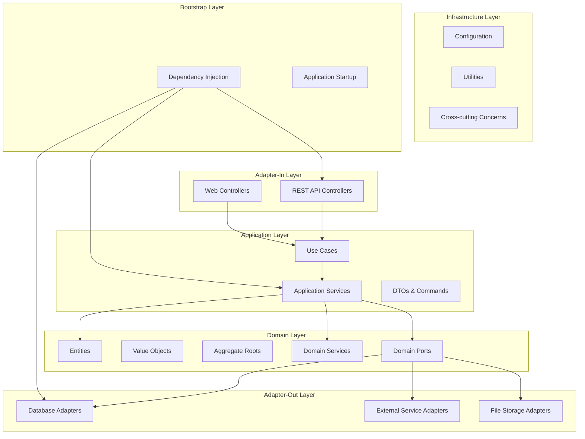

# DDD 六边形架构重构设计文档

## 概述

本设计文档详细描述了如何将 CleverOnion Blog 系统从传统分层架构重构为基于领域驱动设计（DDD）和六边形架构的现代化架构。设计遵循 SOLID 原则、依赖倒置原则和关注点分离原则。

## 架构设计

### 整体架构图



### 目录结构设计

```
src/main/kotlin/com/cleveronion/
├── domain/                          # 领域层
│   ├── article/                     # 文章聚合
│   │   ├── aggregate/
│   │   │   └── Article.kt          # 文章聚合根
│   │   ├── valueobject/
│   │   │   ├── ArticleId.kt        # 文章ID值对象
│   │   │   ├── ArticleContent.kt   # 文章内容值对象
│   │   │   ├── ArticleStatus.kt    # 文章状态值对象
│   │   │   └── ArticleTitle.kt     # 文章标题值对象
│   │   ├── service/
│   │   │   └── ArticleDomainService.kt
│   │   └── port/
│   │       └── ArticleRepositoryPort.kt
│   ├── user/                        # 用户聚合
│   │   ├── aggregate/
│   │   │   └── User.kt             # 用户聚合根
│   │   ├── valueobject/
│   │   │   ├── UserId.kt           # 用户ID值对象
│   │   │   ├── Email.kt
│   │   │   ├── GitHubId.kt
│   │   │   └── UserProfile.kt
│   │   ├── service/
│   │   │   └── UserDomainService.kt
│   │   └── port/
│   │       └── UserRepositoryPort.kt
│   ├── comment/                     # 评论聚合
│   │   ├── aggregate/
│   │   │   └── Comment.kt          # 评论聚合根
│   │   ├── valueobject/
│   │   │   ├── CommentId.kt        # 评论ID值对象
│   │   │   └── CommentContent.kt
│   │   ├── service/
│   │   │   └── CommentDomainService.kt
│   │   └── port/
│   │       └── CommentRepositoryPort.kt
│   ├── tag/                         # 标签聚合
│   │   ├── aggregate/
│   │   │   └── Tag.kt              # 标签聚合根
│   │   ├── valueobject/
│   │   │   ├── TagId.kt            # 标签ID值对象
│   │   │   └── TagName.kt
│   │   └── port/
│   │       └── TagRepositoryPort.kt
│   └── shared/                      # 共享领域概念
│       ├── aggregate/
│       │   └── AggregateRoot.kt    # 聚合根基类
│       ├── event/
│       │   ├── DomainEvent.kt      # 领域事件基类
│       │   ├── ArticlePublishedEvent.kt
│       │   ├── UserEmailChangedEvent.kt
│       │   ├── CommentUpdatedEvent.kt
│       │   └── TagRenamedEvent.kt
│       ├── exception/
│       │   ├── DomainException.kt
│       │   ├── EntityNotFoundException.kt
│       │   └── BusinessRuleViolationException.kt
│       └── valueobject/
│           ├── CreatedAt.kt
│           ├── UpdatedAt.kt
│           └── Pagination.kt
├── application/                     # 应用层
│   ├── article/
│   │   ├── usecase/
│   │   │   ├── CreateArticleUseCase.kt
│   │   │   ├── PublishArticleUseCase.kt
│   │   │   ├── UpdateArticleUseCase.kt
│   │   │   └── DeleteArticleUseCase.kt
│   │   ├── service/
│   │   │   └── ArticleApplicationService.kt
│   │   ├── command/
│   │   │   ├── CreateArticleCommand.kt
│   │   │   ├── PublishArticleCommand.kt
│   │   │   └── UpdateArticleCommand.kt
│   │   ├── query/
│   │   │   ├── GetArticleQuery.kt
│   │   │   └── SearchArticlesQuery.kt
│   │   └── dto/
│   │       ├── ArticleDto.kt
│   │       └── ArticleListDto.kt
│   ├── user/
│   │   ├── usecase/
│   │   │   ├── AuthenticateUserUseCase.kt
│   │   │   ├── RegisterUserUseCase.kt
│   │   │   └── UpdateUserProfileUseCase.kt
│   │   ├── service/
│   │   │   └── UserApplicationService.kt
│   │   ├── command/
│   │   │   ├── AuthenticateUserCommand.kt
│   │   │   └── UpdateUserProfileCommand.kt
│   │   └── dto/
│   │       └── UserDto.kt
│   ├── comment/
│   │   ├── usecase/
│   │   │   ├── CreateCommentUseCase.kt
│   │   │   ├── ReplyToCommentUseCase.kt
│   │   │   └── DeleteCommentUseCase.kt
│   │   ├── service/
│   │   │   └── CommentApplicationService.kt
│   │   ├── command/
│   │   │   ├── CreateCommentCommand.kt
│   │   │   └── ReplyToCommentCommand.kt
│   │   └── dto/
│   │       └── CommentDto.kt
│   ├── upload/
│   │   ├── usecase/
│   │   │   ├── UploadImageUseCase.kt
│   │   │   └── DeleteImageUseCase.kt
│   │   ├── service/
│   │   │   └── UploadApplicationService.kt
│   │   ├── command/
│   │   │   └── UploadImageCommand.kt
│   │   └── dto/
│   │       └── UploadResultDto.kt
│   └── shared/
│       ├── exception/
│       │   ├── ApplicationException.kt
│       │   └── ValidationException.kt
│       ├── port/
│       │   ├── FileStoragePort.kt
│       │   ├── EmailNotificationPort.kt
│       │   └── EventPublisherPort.kt
│       └── dto/
│           ├── PaginationDto.kt
│           └── ApiResponseDto.kt
├── infrastructure/                  # 基础设施层
│   ├── database/
│   │   ├── config/
│   │   │   └── DatabaseConfig.kt
│   │   ├── entity/
│   │   │   ├── ArticleEntity.kt
│   │   │   ├── UserEntity.kt
│   │   │   ├── CommentEntity.kt
│   │   │   └── TagEntity.kt
│   │   └── migration/
│   │       └── DatabaseMigration.kt
│   ├── security/
│   │   ├── jwt/
│   │   │   ├── JwtConfig.kt
│   │   │   └── JwtUtil.kt
│   │   └── oauth/
│   │       └── GitHubOAuthConfig.kt
│   ├── storage/
│   │   ├── oss/
│   │   │   └── OssConfig.kt
│   │   └── local/
│   │       └── LocalFileConfig.kt
│   ├── monitoring/
│   │   ├── logging/
│   │   │   └── LoggingConfig.kt
│   │   └── metrics/
│   │       └── MetricsConfig.kt
│   └── serialization/
│       └── SerializationConfig.kt
├── adapter-in/                      # 入站适配器
│   ├── rest/
│   │   ├── article/
│   │   │   └── ArticleRestAdapter.kt
│   │   ├── user/
│   │   │   └── UserRestAdapter.kt
│   │   ├── comment/
│   │   │   └── CommentRestAdapter.kt
│   │   ├── auth/
│   │   │   └── AuthRestAdapter.kt
│   │   ├── upload/
│   │   │   └── UploadRestAdapter.kt
│   │   └── shared/
│   │       ├── exception/
│   │       │   └── GlobalExceptionHandler.kt
│   │       ├── security/
│   │       │   └── JwtAuthenticationFilter.kt
│   │       └── validation/
│   │           └── RequestValidator.kt
│   └── web/
│       └── WebAdapter.kt
├── adapter-out/                     # 出站适配器
│   ├── persistence/
│   │   ├── article/
│   │   │   └── ArticleRepositoryAdapter.kt
│   │   ├── user/
│   │   │   └── UserRepositoryAdapter.kt
│   │   ├── comment/
│   │   │   └── CommentRepositoryAdapter.kt
│   │   ├── tag/
│   │   │   └── TagRepositoryAdapter.kt
│   │   └── shared/
│   │       ├── mapper/
│   │       │   ├── ArticleMapper.kt
│   │       │   ├── UserMapper.kt
│   │       │   └── CommentMapper.kt
│   │       └── transaction/
│   │           └── TransactionManager.kt
│   ├── external/
│   │   ├── github/
│   │   │   └── GitHubOAuthAdapter.kt
│   │   ├── email/
│   │   │   └── EmailNotificationAdapter.kt
│   │   └── storage/
│   │       ├── OssFileStorageAdapter.kt
│   │       └── LocalFileStorageAdapter.kt
│   └── event/
│       └── EventPublisherAdapter.kt
├── bootstrap/                       # 启动配置层
│   ├── config/
│   │   ├── DependencyInjectionConfig.kt
│   │   ├── ApplicationConfig.kt
│   │   └── EnvironmentConfig.kt
│   ├── module/
│   │   ├── DomainModule.kt
│   │   ├── ApplicationModule.kt
│   │   ├── InfrastructureModule.kt
│   │   └── AdapterModule.kt
│   └── Application.kt
└── common/                          # 通用组件
    ├── exception/
    │   ├── SystemException.kt
    │   └── ExceptionHandler.kt
    ├── util/
    │   ├── DateTimeUtil.kt
    │   ├── ValidationUtil.kt
    │   └── StringUtil.kt
    ├── annotation/
    │   ├── UseCase.kt
    │   ├── DomainService.kt
    │   └── Adapter.kt
    └── constant/
        └── ApplicationConstants.kt
```

## 组件设计

### 领域层设计

#### 聚合设计原则

在 DDD 中，聚合（Aggregate）是领域模型的核心构建块，每个聚合都有一个聚合根（Aggregate Root）作为唯一的入口点。聚合根负责维护聚合内部的一致性和业务规则。

**聚合边界划分：**
- **Article 聚合**：以 Article 为聚合根，包含文章内容、标签关联、状态管理
- **User 聚合**：以 User 为聚合根，包含用户信息、权限管理
- **Comment 聚合**：以 Comment 为聚合根，包含评论内容、回复关系
- **Tag 聚合**：以 Tag 为聚合根，独立的标签管理

**聚合设计规则：**
1. 聚合根是唯一可以被外部直接引用的实体
2. 聚合内部的实体只能通过聚合根访问
3. 聚合之间只能通过 ID 引用，不能直接持有对象引用
4. 每个聚合在一个事务中保持一致性

#### 文章聚合设计

```kotlin
// Article 聚合根
class Article private constructor(
    val id: ArticleId,
    private var title: ArticleTitle,
    private var content: ArticleContent,
    private var status: ArticleStatus,
    val authorId: UserId,
    private var tags: MutableSet<TagId>,
    private var viewCount: Int,
    val createdAt: CreatedAt,
    private var updatedAt: UpdatedAt
) : AggregateRoot<ArticleId>() {
    companion object {
        fun create(
            title: ArticleTitle,
            content: ArticleContent,
            authorId: UserId,
            tags: Set<TagId> = emptySet()
        ): Article {
            return Article(
                id = ArticleId.generate(),
                title = title,
                content = content,
                status = ArticleStatus.DRAFT,
                authorId = authorId,
                tags = tags.toMutableSet(),
                viewCount = 0,
                createdAt = CreatedAt.now(),
                updatedAt = UpdatedAt.now()
            )
        }
    }
    
    fun publish(): Article {
        if (status == ArticleStatus.PUBLISHED) {
            throw BusinessRuleViolationException("Article is already published")
        }
        status = ArticleStatus.PUBLISHED
        updatedAt = UpdatedAt.now()
        return this
    }
    
    fun archive(): Article {
        if (status == ArticleStatus.ARCHIVED) {
            throw BusinessRuleViolationException("Article is already archived")
        }
        status = ArticleStatus.ARCHIVED
        updatedAt = UpdatedAt.now()
        return this
    }
    
    fun updateContent(newTitle: ArticleTitle, newContent: ArticleContent): Article {
        title = newTitle
        content = newContent
        updatedAt = UpdatedAt.now()
        return this
    }
    
    fun addTag(tagId: TagId): Article {
        if (tags.size >= 10) {
            throw BusinessRuleViolationException("Article cannot have more than 10 tags")
        }
        tags.add(tagId)
        updatedAt = UpdatedAt.now()
        return this
    }
    
    fun incrementViewCount(): Article {
        viewCount++
        return this
    }
    
    fun canBeEditedBy(userId: UserId): Boolean {
        return authorId == userId
    }
    
    // 实现聚合根基类的抽象方法
    override fun ensureBusinessRules() {
        if (status == ArticleStatus.PUBLISHED && content.markdown.isBlank()) {
            throw BusinessRuleViolationException("Published article must have content")
        }
        if (tags.size > 10) {
            throw BusinessRuleViolationException("Article cannot have more than 10 tags")
        }
    }
    
    // 重写 publish 方法以添加领域事件
    fun publish(): Article {
        if (status == ArticleStatus.PUBLISHED) {
            throw BusinessRuleViolationException("Article is already published")
        }
        status = ArticleStatus.PUBLISHED
        updatedAt = UpdatedAt.now()
        
        // 发布领域事件
        addDomainEvent(ArticlePublishedEvent(id, authorId, title.value))
        
        return this
    }
    
    // 实现聚合根基类的抽象方法
    override fun getId(): ArticleId = id
    
    // Getters
    fun getTitle(): ArticleTitle = title
    fun getContent(): ArticleContent = content
    fun getStatus(): ArticleStatus = status
    fun getTags(): Set<TagId> = tags.toSet()
    fun getViewCount(): Int = viewCount
    fun getUpdatedAt(): UpdatedAt = updatedAt
}

// ArticleContent 值对象
data class ArticleContent(
    val markdown: String,
    val html: String
) {
    init {
        require(markdown.isNotBlank()) { "Markdown content cannot be blank" }
        require(markdown.length <= 50000) { "Markdown content cannot exceed 50000 characters" }
        require(html.isNotBlank()) { "HTML content cannot be blank" }
    }
    
    companion object {
        fun fromMarkdown(markdown: String): ArticleContent {
            val html = MarkdownProcessor.toHtml(markdown)
            return ArticleContent(markdown, html)
        }
    }
}

// ArticleStatus 值对象
enum class ArticleStatus {
    DRAFT, PUBLISHED, ARCHIVED;
    
    fun canTransitionTo(newStatus: ArticleStatus): Boolean {
        return when (this) {
            DRAFT -> newStatus in setOf(PUBLISHED, ARCHIVED)
            PUBLISHED -> newStatus == ARCHIVED
            ARCHIVED -> false
        }
    }
}

// 聚合根基类
abstract class AggregateRoot<T> {
    private val domainEvents = mutableListOf<DomainEvent>()
    
    /**
     * 获取聚合产生的领域事件
     */
    fun getDomainEvents(): List<DomainEvent> = domainEvents.toList()
    
    /**
     * 清除已处理的领域事件
     */
    fun clearDomainEvents() {
        domainEvents.clear()
    }
    
    /**
     * 添加领域事件
     */
    protected fun addDomainEvent(event: DomainEvent) {
        domainEvents.add(event)
    }
    
    /**
     * 聚合根必须实现业务规则验证
     */
    abstract fun ensureBusinessRules()
    
    /**
     * 获取聚合根标识符
     */
    abstract fun getId(): T
    
    /**
     * 聚合根相等性比较基于标识符
     */
    override fun equals(other: Any?): Boolean {
        if (this === other) return true
        if (other !is AggregateRoot<*>) return false
        return getId() == other.getId()
    }
    
    override fun hashCode(): Int {
        return getId()?.hashCode() ?: 0
    }
}

// 领域事件基类
interface DomainEvent {
    val occurredOn: Instant
    val aggregateId: String
}

// 文章发布事件
data class ArticlePublishedEvent(
    val articleId: ArticleId,
    val authorId: UserId,
    val title: String,
    override val occurredOn: Instant = Instant.now(),
    override val aggregateId: String = articleId.value.toString()
) : DomainEvent

// 用户邮箱变更事件
data class UserEmailChangedEvent(
    val userId: UserId,
    val oldEmail: Email?,
    val newEmail: Email?,
    override val occurredOn: Instant = Instant.now(),
    override val aggregateId: String = userId.value.toString()
) : DomainEvent
```

#### 用户聚合设计

```kotlin
// User 聚合根
class User private constructor(
    val id: UserId,
    val githubId: GitHubId,
    private var profile: UserProfile,
    val createdAt: CreatedAt,
    private var updatedAt: UpdatedAt
) : AggregateRoot<UserId>() {
    companion object {
        fun create(
            githubId: GitHubId,
            profile: UserProfile
        ): User {
            return User(
                id = UserId.generate(),
                githubId = githubId,
                profile = profile,
                createdAt = CreatedAt.now(),
                updatedAt = UpdatedAt.now()
            )
        }
    }
    
    fun updateProfile(newProfile: UserProfile): User {
        profile = newProfile
        updatedAt = UpdatedAt.now()
        return this
    }
    
    fun isAdmin(adminWhitelist: Set<GitHubId>): Boolean {
        return githubId in adminWhitelist
    }
    
    fun canEditArticle(article: Article): Boolean {
        return article.canBeEditedBy(id)
    }
    
    // 实现聚合根基类的抽象方法
    override fun ensureBusinessRules() {
        if (profile.githubLogin.isBlank()) {
            throw BusinessRuleViolationException("User must have GitHub login")
        }
        profile.email?.let { email ->
            if (!email.isValid()) {
                throw BusinessRuleViolationException("Invalid email format")
            }
        }
    }
    
    // 重写 updateProfile 方法以添加领域事件
    fun updateProfile(newProfile: UserProfile): User {
        val oldProfile = profile
        profile = newProfile
        updatedAt = UpdatedAt.now()
        
        // 如果邮箱发生变化，发布事件
        if (oldProfile.email != newProfile.email) {
            addDomainEvent(UserEmailChangedEvent(id, oldProfile.email, newProfile.email))
        }
        
        return this
    }
    
    // 实现聚合根基类的抽象方法
    override fun getId(): UserId = id
    
    // Getters
    fun getProfile(): UserProfile = profile
    fun getUpdatedAt(): UpdatedAt = updatedAt
}

// UserProfile 值对象
data class UserProfile(
    val githubLogin: String,
    val email: Email?,
    val name: String?,
    val bio: String?,
    val avatarUrl: String?
) {
    init {
        require(githubLogin.isNotBlank()) { "GitHub login cannot be blank" }
        require(githubLogin.length <= 100) { "GitHub login cannot exceed 100 characters" }
        bio?.let { require(it.length <= 500) { "Bio cannot exceed 500 characters" } }
    }
}

// ID 值对象设计
data class ArticleId(val value: Long) {
    init {
        require(value > 0) { "Article ID must be positive" }
    }
    
    companion object {
        fun generate(): ArticleId = ArticleId(System.currentTimeMillis()) // 简化示例，实际应使用更好的ID生成策略
    }
}

data class UserId(val value: Long) {
    init {
        require(value > 0) { "User ID must be positive" }
    }
    
    companion object {
        fun generate(): UserId = UserId(System.currentTimeMillis())
    }
}

data class TagId(val value: Long) {
    init {
        require(value > 0) { "Tag ID must be positive" }
    }
    
    companion object {
        fun generate(): TagId = TagId(System.currentTimeMillis())
    }
}

data class CommentId(val value: Long) {
    init {
        require(value > 0) { "Comment ID must be positive" }
    }
    
    companion object {
        fun generate(): CommentId = CommentId(System.currentTimeMillis())
    }
}

// GitHubId 值对象
data class GitHubId(val value: Long) {
    init {
        require(value > 0) { "GitHub ID must be positive" }
    }
}

// Email 值对象
data class Email(val value: String) {
    init {
        require(value.isNotBlank()) { "Email cannot be blank" }
        require(isValidEmail(value)) { "Invalid email format" }
    }
    
    fun isValid(): Boolean = isValidEmail(value)
    
    private fun isValidEmail(email: String): Boolean {
        return email.matches(Regex("^[A-Za-z0-9+_.-]+@[A-Za-z0-9.-]+\\.[A-Za-z]{2,}$"))
    }
}

// ArticleTitle 值对象
data class ArticleTitle(val value: String) {
    init {
        require(value.isNotBlank()) { "Article title cannot be blank" }
        require(value.length <= 255) { "Article title cannot exceed 255 characters" }
    }
}
```

#### 评论聚合设计

```kotlin
// Comment 聚合根
class Comment private constructor(
    val id: CommentId,
    val articleId: ArticleId,
    val userId: UserId,
    private var content: CommentContent,
    val parentId: CommentId?,
    val createdAt: CreatedAt,
    private var updatedAt: UpdatedAt
) : AggregateRoot<CommentId>() {
    
    companion object {
        fun create(
            articleId: ArticleId,
            userId: UserId,
            content: CommentContent,
            parentId: CommentId? = null
        ): Comment {
            return Comment(
                id = CommentId.generate(),
                articleId = articleId,
                userId = userId,
                content = content,
                parentId = parentId,
                createdAt = CreatedAt.now(),
                updatedAt = UpdatedAt.now()
            )
        }
    }
    
    fun updateContent(newContent: CommentContent): Comment {
        content = newContent
        updatedAt = UpdatedAt.now()
        addDomainEvent(CommentUpdatedEvent(id, articleId, userId))
        return this
    }
    
    fun isReply(): Boolean = parentId != null
    
    fun canBeEditedBy(userId: UserId): Boolean = this.userId == userId
    
    override fun ensureBusinessRules() {
        if (content.value.isBlank()) {
            throw BusinessRuleViolationException("Comment content cannot be blank")
        }
        if (content.value.length > 1000) {
            throw BusinessRuleViolationException("Comment content cannot exceed 1000 characters")
        }
    }
    
    // 实现聚合根基类的抽象方法
    override fun getId(): CommentId = id
    
    // Getters
    fun getContent(): CommentContent = content
    fun getUpdatedAt(): UpdatedAt = updatedAt
}

// CommentContent 值对象
data class CommentContent(val value: String) {
    init {
        require(value.isNotBlank()) { "Comment content cannot be blank" }
        require(value.length <= 1000) { "Comment content cannot exceed 1000 characters" }
    }
}
```

#### 标签聚合设计

```kotlin
// Tag 聚合根
class Tag private constructor(
    val id: TagId,
    private var name: TagName,
    private var articleCount: Int = 0
) : AggregateRoot<TagId>() {
    
    companion object {
        fun create(name: TagName): Tag {
            return Tag(
                id = TagId.generate(),
                name = name,
                articleCount = 0
            )
        }
    }
    
    fun updateName(newName: TagName): Tag {
        name = newName
        addDomainEvent(TagRenamedEvent(id, name.value, newName.value))
        return this
    }
    
    fun incrementArticleCount(): Tag {
        articleCount++
        return this
    }
    
    fun decrementArticleCount(): Tag {
        if (articleCount > 0) {
            articleCount--
        }
        return this
    }
    
    override fun ensureBusinessRules() {
        if (name.value.isBlank()) {
            throw BusinessRuleViolationException("Tag name cannot be blank")
        }
        if (articleCount < 0) {
            throw BusinessRuleViolationException("Article count cannot be negative")
        }
    }
    
    // 实现聚合根基类的抽象方法
    override fun getId(): TagId = id
    
    // Getters
    fun getName(): TagName = name
    fun getArticleCount(): Int = articleCount
}

// TagName 值对象
data class TagName(val value: String) {
    init {
        require(value.isNotBlank()) { "Tag name cannot be blank" }
        require(value.length <= 50) { "Tag name cannot exceed 50 characters" }
        require(value.matches(Regex("^[a-zA-Z0-9\\u4e00-\\u9fa5_-]+$"))) { 
            "Tag name can only contain letters, numbers, Chinese characters, underscore and hyphen" 
        }
    }
}

// 评论更新事件
data class CommentUpdatedEvent(
    val commentId: CommentId,
    val articleId: ArticleId,
    val userId: UserId,
    override val occurredOn: Instant = Instant.now(),
    override val aggregateId: String = commentId.value.toString()
) : DomainEvent

// 标签重命名事件
data class TagRenamedEvent(
    val tagId: TagId,
    val oldName: String,
    val newName: String,
    override val occurredOn: Instant = Instant.now(),
    override val aggregateId: String = tagId.value.toString()
) : DomainEvent
```

### 应用层设计

#### 用例设计

```kotlin
// CreateArticleUseCase
@UseCase
class CreateArticleUseCase(
    private val articleRepository: ArticleRepositoryPort,
    private val userRepository: UserRepositoryPort,
    private val tagRepository: TagRepositoryPort
) {
    suspend fun execute(command: CreateArticleCommand): ArticleDto {
        // 验证用户存在
        val authorId = UserId(command.authorId)
        val user = userRepository.findById(authorId)
            ?: throw EntityNotFoundException("User not found: ${command.authorId}")
        
        // 处理标签
        val tagIds = processTagsForArticle(command.tags)
        
        // 创建文章
        val article = Article.create(
            title = ArticleTitle(command.title),
            content = ArticleContent.fromMarkdown(command.contentMd),
            authorId = authorId,
            tags = tagIds
        )
        
        // 保存文章
        val savedArticle = articleRepository.save(article)
        
        return ArticleDto.fromDomain(savedArticle)
    }
    
    private suspend fun processTagsForArticle(tagNames: List<String>): Set<TagId> {
        return tagNames.map { tagName ->
            tagRepository.findByName(TagName(tagName))?.id
                ?: tagRepository.save(Tag.create(TagName(tagName))).id
        }.toSet()
    }
}

// PublishArticleUseCase
@UseCase
class PublishArticleUseCase(
    private val articleRepository: ArticleRepositoryPort,
    private val eventPublisher: EventPublisherPort
) {
    suspend fun execute(command: PublishArticleCommand): ArticleDto {
        val articleId = ArticleId(command.articleId)
        val userId = UserId(command.userId)
        
        val article = articleRepository.findById(articleId)
            ?: throw EntityNotFoundException("Article not found: ${command.articleId}")
        
        // 验证权限
        if (!article.canBeEditedBy(userId)) {
            throw UnauthorizedOperationException("User cannot publish this article")
        }
        
        // 发布文章
        val publishedArticle = article.publish()
        val savedArticle = articleRepository.save(publishedArticle)
        
        // 发布事件
        eventPublisher.publish(ArticlePublishedEvent(savedArticle.id, savedArticle.authorId))
        
        return ArticleDto.fromDomain(savedArticle)
    }
}
```

#### 应用服务设计

```kotlin
// ArticleApplicationService
@Service
class ArticleApplicationService(
    private val createArticleUseCase: CreateArticleUseCase,
    private val publishArticleUseCase: PublishArticleUseCase,
    private val updateArticleUseCase: UpdateArticleUseCase,
    private val deleteArticleUseCase: DeleteArticleUseCase,
    private val getArticleUseCase: GetArticleUseCase,
    private val searchArticlesUseCase: SearchArticlesUseCase
) {
    suspend fun createArticle(command: CreateArticleCommand): ArticleDto {
        return createArticleUseCase.execute(command)
    }
    
    suspend fun publishArticle(command: PublishArticleCommand): ArticleDto {
        return publishArticleUseCase.execute(command)
    }
    
    suspend fun updateArticle(command: UpdateArticleCommand): ArticleDto {
        return updateArticleUseCase.execute(command)
    }
    
    suspend fun deleteArticle(command: DeleteArticleCommand) {
        deleteArticleUseCase.execute(command)
    }
    
    suspend fun getArticle(query: GetArticleQuery): ArticleDto {
        return getArticleUseCase.execute(query)
    }
    
    suspend fun searchArticles(query: SearchArticlesQuery): ArticleListDto {
        return searchArticlesUseCase.execute(query)
    }
}

// 命令和查询对象设计
data class CreateArticleCommand(
    val title: String,
    val contentMd: String,
    val authorId: Long, // 使用原始类型，在用例中转换为值对象
    val tags: List<String>
)

data class PublishArticleCommand(
    val articleId: Long,
    val userId: Long
)

data class UpdateArticleCommand(
    val articleId: Long,
    val userId: Long,
    val title: String?,
    val contentMd: String?,
    val tags: List<String>?
)

data class GetArticleQuery(
    val articleId: Long,
    val includeUnpublished: Boolean = false,
    val requestUserId: Long? = null
)

data class SearchArticlesQuery(
    val keyword: String? = null,
    val authorId: Long? = null,
    val status: String? = null,
    val tags: List<String>? = null,
    val page: Int = 1,
    val pageSize: Int = 20
)

// DTO 设计
data class ArticleDto(
    val id: Long,
    val authorId: Long,
    val title: String,
    val contentMd: String,
    val contentHtml: String,
    val status: String,
    val tags: List<TagDto>,
    val viewCount: Int,
    val createdAt: String,
    val updatedAt: String
) {
    companion object {
        fun fromDomain(article: Article, tags: List<Tag> = emptyList()): ArticleDto {
            return ArticleDto(
                id = article.getId().value,
                authorId = article.authorId.value,
                title = article.getTitle().value,
                contentMd = article.getContent().markdown,
                contentHtml = article.getContent().html,
                status = article.getStatus().name,
                tags = tags.map { TagDto.fromDomain(it) },
                viewCount = article.getViewCount(),
                createdAt = article.createdAt.value.toString(),
                updatedAt = article.getUpdatedAt().value.toString()
            )
        }
    }
}

data class TagDto(
    val id: Long,
    val name: String,
    val articleCount: Int
) {
    companion object {
        fun fromDomain(tag: Tag): TagDto {
            return TagDto(
                id = tag.getId().value,
                name = tag.getName().value,
                articleCount = tag.getArticleCount()
            )
        }
    }
}

data class UserDto(
    val id: Long,
    val githubId: Long,
    val githubLogin: String,
    val email: String?,
    val name: String?,
    val bio: String?,
    val avatarUrl: String?,
    val createdAt: String,
    val updatedAt: String
) {
    companion object {
        fun fromDomain(user: User): UserDto {
            val profile = user.getProfile()
            return UserDto(
                id = user.getId().value,
                githubId = user.githubId.value,
                githubLogin = profile.githubLogin,
                email = profile.email?.value,
                name = profile.name,
                bio = profile.bio,
                avatarUrl = profile.avatarUrl,
                createdAt = user.createdAt.value.toString(),
                updatedAt = user.getUpdatedAt().value.toString()
            )
        }
    }
}
```

### 适配器设计

#### 入站适配器设计

```kotlin
// ArticleRestAdapter
@RestController
@Route("/api/v1/articles")
class ArticleRestAdapter(
    private val articleApplicationService: ArticleApplicationService,
    private val requestValidator: RequestValidator
) {
    @Post
    @Authenticated
    suspend fun createArticle(call: ApplicationCall) {
        val request = call.receive<CreateArticleRequest>()
        requestValidator.validate(request)
        
        val command = CreateArticleCommand(
            title = request.title,
            contentMd = request.contentMd,
            authorId = call.principal<JWTPrincipal>()!!.getUserId().value, // 传递原始值
            tags = request.tags ?: emptyList()
        )
        
        val result = articleApplicationService.createArticle(command)
        call.respond(HttpStatusCode.Created, ApiResponse.success(result))
    }
    
    @Put("/{id}/publish")
    @Authenticated
    suspend fun publishArticle(call: ApplicationCall) {
        val articleId = call.parameters["id"]?.let { ArticleId(it.toLong()) }
            ?: throw ValidationException("Invalid article ID")
        
        val command = PublishArticleCommand(
            articleId = articleId.value, // 传递原始值
            userId = call.principal<JWTPrincipal>()!!.getUserId().value // 传递原始值
        )
        
        val result = articleApplicationService.publishArticle(command)
        call.respond(HttpStatusCode.OK, ApiResponse.success(result))
    }
    
    @Get
    suspend fun getArticles(call: ApplicationCall) {
        val query = SearchArticlesQuery(
            page = call.request.queryParameters["page"]?.toIntOrNull() ?: 1,
            pageSize = call.request.queryParameters["pageSize"]?.toIntOrNull() ?: 20,
            authorId = call.request.queryParameters["authorId"]?.let { UserId(it.toLong()) },
            status = ArticleStatus.PUBLISHED
        )
        
        val result = articleApplicationService.searchArticles(query)
        call.respond(HttpStatusCode.OK, ApiResponse.success(result))
    }
}
```

#### 出站适配器设计

```kotlin
// ArticleRepositoryAdapter
@Repository
class ArticleRepositoryAdapter(
    private val database: Database,
    private val articleMapper: ArticleMapper
) : ArticleRepositoryPort {
    
    override suspend fun save(article: Article): Article {
        return database.dbQuery {
            val entity = articleMapper.toEntity(article)
            
            if (ArticleEntity.findById(entity.id) != null) {
                // Update existing
                ArticleEntity.findById(entity.id)?.apply {
                    title = entity.title
                    contentMd = entity.contentMd
                    contentHtml = entity.contentHtml
                    status = entity.status
                    updatedAt = entity.updatedAt
                }
            } else {
                // Create new
                ArticleEntity.new(entity.id) {
                    authorId = entity.authorId
                    title = entity.title
                    contentMd = entity.contentMd
                    contentHtml = entity.contentHtml
                    status = entity.status
                    viewCount = entity.viewCount
                    createdAt = entity.createdAt
                    updatedAt = entity.updatedAt
                }
            }
            
            articleMapper.toDomain(entity)
        }
    }
    
    override suspend fun findById(id: ArticleId): Article? {
        return database.dbQuery {
            ArticleEntity.findById(id.value)?.let { entity ->
                articleMapper.toDomain(entity)
            }
        }
    }
    
    override suspend fun findByAuthorId(
        authorId: UserId,
        pagination: Pagination
    ): List<Article> {
        return database.dbQuery {
            ArticleEntity.find { Articles.authorId eq authorId.value }
                .limit(pagination.pageSize, pagination.offset)
                .map { articleMapper.toDomain(it) }
        }
    }
    
    override suspend fun search(
        keyword: String?,
        status: ArticleStatus?,
        pagination: Pagination
    ): List<Article> {
        return database.dbQuery {
            var query = Articles.selectAll()
            
            keyword?.let {
                query = query.andWhere { 
                    (Articles.title like "%$it%") or (Articles.contentMd like "%$it%")
                }
            }
            
            status?.let {
                query = query.andWhere { Articles.status eq it.name }
            }
            
            query.limit(pagination.pageSize, pagination.offset)
                .map { row -> articleMapper.toDomain(row) }
        }
    }
    
    override suspend fun delete(id: ArticleId) {
        database.dbQuery {
            ArticleEntity.findById(id.value)?.delete()
        }
    }
}
```

### 依赖注入设计

```kotlin
// DependencyInjectionConfig
object DependencyInjectionConfig {
    fun configureKoin(): Module = module {
        // Domain Services
        single<ArticleDomainService> { ArticleDomainService() }
        single<UserDomainService> { UserDomainService() }
        
        // Application Services
        single<ArticleApplicationService> { 
            ArticleApplicationService(get(), get(), get(), get(), get(), get()) 
        }
        single<UserApplicationService> { 
            UserApplicationService(get(), get(), get()) 
        }
        
        // Use Cases
        single<CreateArticleUseCase> { CreateArticleUseCase(get(), get(), get()) }
        single<PublishArticleUseCase> { PublishArticleUseCase(get(), get()) }
        single<UpdateArticleUseCase> { UpdateArticleUseCase(get(), get()) }
        
        // Repository Ports (Interfaces)
        single<ArticleRepositoryPort> { ArticleRepositoryAdapter(get(), get()) }
        single<UserRepositoryPort> { UserRepositoryAdapter(get(), get()) }
        single<CommentRepositoryPort> { CommentRepositoryAdapter(get(), get()) }
        
        // External Service Ports
        single<FileStoragePort> { OssFileStorageAdapter(get()) }
        single<EmailNotificationPort> { EmailNotificationAdapter(get()) }
        single<EventPublisherPort> { EventPublisherAdapter() }
        
        // Infrastructure
        single<Database> { DatabaseConfig.createDatabase(get()) }
        single<OssConfig> { OssConfig.fromEnvironment() }
        single<JwtConfig> { JwtConfig.fromEnvironment() }
        
        // Mappers
        single<ArticleMapper> { ArticleMapper() }
        single<UserMapper> { UserMapper() }
        single<CommentMapper> { CommentMapper() }
        
        // Adapters
        single<ArticleRestAdapter> { ArticleRestAdapter(get(), get()) }
        single<UserRestAdapter> { UserRestAdapter(get(), get()) }
        single<AuthRestAdapter> { AuthRestAdapter(get(), get()) }
        
        // Utilities
        single<RequestValidator> { RequestValidator() }
        single<GlobalExceptionHandler> { GlobalExceptionHandler() }
    }
}
```

## 数据模型映射

### 领域模型到数据库实体映射

```kotlin
// ArticleMapper
class ArticleMapper {
    fun toDomain(entity: ArticleEntity): Article {
        return Article.reconstruct(
            id = ArticleId(entity.id.value),
            title = ArticleTitle(entity.title),
            content = ArticleContent(entity.contentMd, entity.contentHtml),
            status = ArticleStatus.valueOf(entity.status),
            authorId = UserId(entity.authorId),
            tags = entity.tags.map { TagId(it.id.value) }.toSet(),
            viewCount = entity.viewCount,
            createdAt = CreatedAt(entity.createdAt),
            updatedAt = UpdatedAt(entity.updatedAt)
        )
    }
    
    fun toEntity(domain: Article): ArticleEntityData {
        return ArticleEntityData(
            id = domain.id.value,
            authorId = domain.authorId.value,
            title = domain.getTitle().value,
            contentMd = domain.getContent().markdown,
            contentHtml = domain.getContent().html,
            status = domain.getStatus().name,
            viewCount = domain.getViewCount(),
            createdAt = domain.createdAt.value,
            updatedAt = domain.getUpdatedAt().value
        )
    }
}
```

## 错误处理策略

### 异常层次结构

```kotlin
// 领域异常
sealed class DomainException(message: String, cause: Throwable? = null) : Exception(message, cause)

class EntityNotFoundException(message: String) : DomainException(message)
class BusinessRuleViolationException(message: String) : DomainException(message)
class UnauthorizedOperationException(message: String) : DomainException(message)

// 应用异常
sealed class ApplicationException(message: String, cause: Throwable? = null) : Exception(message, cause)

class ValidationException(message: String) : ApplicationException(message)
class UseCaseExecutionException(message: String, cause: Throwable) : ApplicationException(message, cause)

// 基础设施异常
sealed class InfrastructureException(message: String, cause: Throwable? = null) : Exception(message, cause)

class DatabaseException(message: String, cause: Throwable) : InfrastructureException(message, cause)
class ExternalServiceException(message: String, cause: Throwable) : InfrastructureException(message, cause)
```

### 全局异常处理

```kotlin
@Component
class GlobalExceptionHandler {
    fun handleDomainException(exception: DomainException): ApiResponse<Nothing> {
        return when (exception) {
            is EntityNotFoundException -> ApiResponse.error(
                message = exception.message ?: "Entity not found",
                httpStatus = HttpStatusCode.NotFound
            )
            is BusinessRuleViolationException -> ApiResponse.error(
                message = exception.message ?: "Business rule violation",
                httpStatus = HttpStatusCode.BadRequest
            )
            is UnauthorizedOperationException -> ApiResponse.error(
                message = exception.message ?: "Unauthorized operation",
                httpStatus = HttpStatusCode.Forbidden
            )
        }
    }
    
    fun handleApplicationException(exception: ApplicationException): ApiResponse<Nothing> {
        return when (exception) {
            is ValidationException -> ApiResponse.error(
                message = exception.message ?: "Validation failed",
                httpStatus = HttpStatusCode.BadRequest
            )
            is UseCaseExecutionException -> ApiResponse.error(
                message = "Use case execution failed",
                httpStatus = HttpStatusCode.InternalServerError
            )
        }
    }
}
```

## 测试策略

### 测试金字塔

1. **单元测试** (70%)
   - 领域实体和值对象测试
   - 领域服务测试
   - 用例测试（使用 Mock）

2. **集成测试** (20%)
   - 应用服务测试
   - 仓储适配器测试
   - 外部服务适配器测试

3. **端到端测试** (10%)
   - REST API 测试
   - 完整业务流程测试

### 测试示例

```kotlin
// 领域实体单元测试
class ArticleTest {
    @Test
    fun `should create article with draft status`() {
        val article = Article.create(
            title = ArticleTitle("Test Article"),
            content = ArticleContent.fromMarkdown("# Test Content"),
            authorId = UserId(1L)
        )
        
        assertEquals(ArticleStatus.DRAFT, article.getStatus())
        assertNotNull(article.id)
        assertNotNull(article.createdAt)
    }
    
    @Test
    fun `should publish article when in draft status`() {
        val article = Article.create(
            title = ArticleTitle("Test Article"),
            content = ArticleContent.fromMarkdown("# Test Content"),
            authorId = UserId(1L)
        )
        
        val publishedArticle = article.publish()
        
        assertEquals(ArticleStatus.PUBLISHED, publishedArticle.getStatus())
    }
    
    @Test
    fun `should throw exception when publishing already published article`() {
        val article = Article.create(
            title = ArticleTitle("Test Article"),
            content = ArticleContent.fromMarkdown("# Test Content"),
            authorId = UserId(1L)
        ).publish()
        
        assertThrows<BusinessRuleViolationException> {
            article.publish()
        }
    }
}

// 用例集成测试
class CreateArticleUseCaseTest {
    private val articleRepository = mockk<ArticleRepositoryPort>()
    private val userRepository = mockk<UserRepositoryPort>()
    private val tagRepository = mockk<TagRepositoryPort>()
    private val useCase = CreateArticleUseCase(articleRepository, userRepository, tagRepository)
    
    @Test
    fun `should create article successfully`() = runTest {
        // Given
        val command = CreateArticleCommand(
            title = "Test Article",
            contentMd = "# Test Content",
            authorId = UserId(1L),
            tags = listOf("kotlin", "ddd")
        )
        
        val user = User.create(GitHubId(123L), UserProfile("testuser", null, null, null, null))
        every { userRepository.findById(command.authorId) } returns user
        every { tagRepository.findByName(any()) } returns null
        every { tagRepository.save(any()) } returns Tag.create(TagName("kotlin"))
        every { articleRepository.save(any()) } returns mockk()
        
        // When
        val result = useCase.execute(command)
        
        // Then
        assertNotNull(result)
        verify { articleRepository.save(any()) }
    }
}
```

## 迁移策略

### 渐进式迁移计划

1. **第一阶段：基础架构搭建**
   - 创建新的目录结构
   - 设置依赖注入框架
   - 建立基础的领域模型

2. **第二阶段：核心聚合迁移**
   - 迁移 Article 聚合
   - 迁移 User 聚合
   - 保持 API 兼容性

3. **第三阶段：扩展功能迁移**
   - 迁移 Comment 聚合
   - 迁移 Tag 聚合
   - 迁移文件上传功能

4. **第四阶段：优化和清理**
   - 移除旧代码
   - 性能优化
   - 文档更新

### 兼容性保证

- 保持现有 API 接口不变
- 数据库结构保持兼容
- 渐进式替换，支持回滚
- 全面的测试覆盖

这个设计文档提供了完整的 DDD 六边形架构重构方案，包括详细的组件设计、代码示例和迁移策略。架构遵循了领域驱动设计的核心原则，实现了业务逻辑与技术实现的清晰分离。